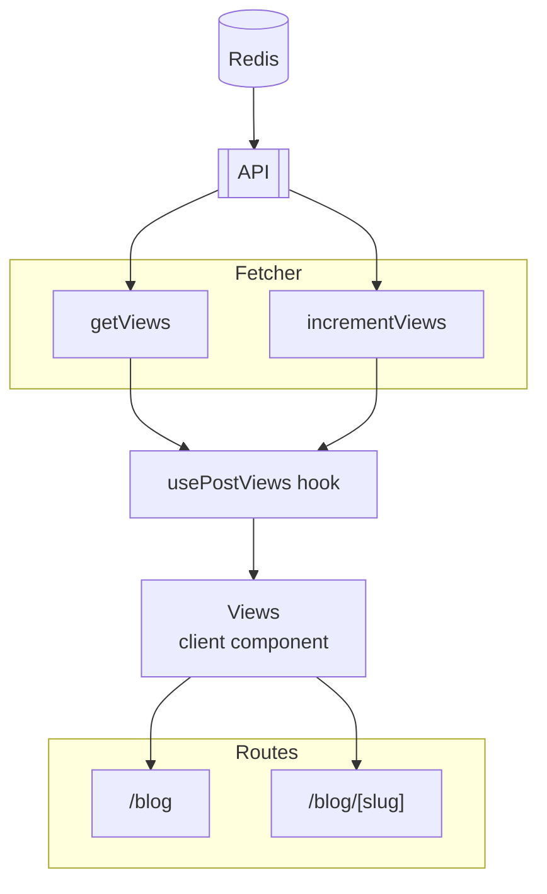

Adding a views counter for your blog is a great way to track how many people are reading your blog posts. In this article, I will invite you to build it precisely as what I have implemented in this website. The step-by-step guide will be catered to Next.js, but for other frameworks, the concept is the same. For that reason, in the beginning of the article, I will try to explain in high level of how it works.

# Overview

{/* <style>{`style + svg { grid-column: 1 / -1 !important; }`}</style> */}


Here is the detailed explanation:

- **Redis**: Views count is stored in Redis database. More precisely, we are going to use serverless Redis database from [Upstash](https://upstash.com/).
- **API**: We will create our API endpoints for fetching and incrementing views count wth Next.js Route Handlers, which we will then have access from `/api/views/[slug]`. This API will interact with Redis database through Upstash JavaScript SDK.
- **Fetcher** : Since `usePostViews` hook is a custom hook that uses [SWR](https://swr.vercel.app/) under the hood, we need `getViews` and `incrementViews` functions as a _fetcher_ for SWR.
- **usePostViews**: Inside this custom hook, we are calling `useSWR` hook that will fetch our data, store it as a mutable state, and also provide a function to mutate the state. This hook will only neatly return the views count and the function to increment the views count.
- **Views Client Component**: This is the component that will be used in our blog post page and also in the blog list page. It will call `usePostViews` hook and render the views count. If this component detected that the page is a blog post page, it will increment the views count when the page is loaded.
- **Routes** : This is the routes that will be used in our blog post page and also in the blog list page. It will render the views client component.

Sounds good? Let's get started.

# Setting Up Redis Database

First, create an Upstash account and create a database. You can follow the [official guide](https://docs.upstash.com/) to do that. Once you have created a database, you will get a Redis URL. Copy that URL and save it in your `.env.local` file.

```bash
# .env.local
NEXT_PUBLIC_REDIS_URL=redis://...
```
